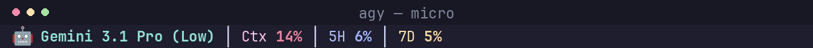
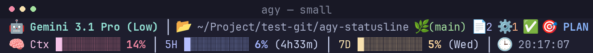
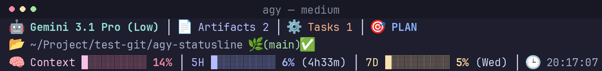
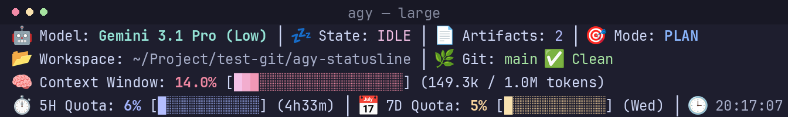
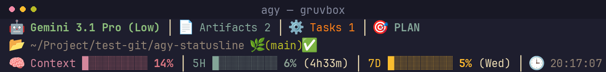

# Antigravity CLI Statusline

A themeable statusline for [Antigravity CLI](https://antigravity.google/) (`agy`): model, permission mode, git status, context window, and usage quota, all at a glance. 4 sizes, 5 themes, auto-shrinks to fit narrow terminals.






## Install

```bash
curl -fsSL https://raw.githubusercontent.com/Hadisd/agy-statusline/main/install.sh | bash
```

Or skip the prompt by specifying size (`micro`/`small`/`medium`/`large`) and theme (`mocha`/`tokyo-night`/`nord`/`dracula`/`gruvbox`) directly:

```bash
curl -fsSL https://raw.githubusercontent.com/Hadisd/agy-statusline/main/install.sh | bash -s -- medium dracula
```

Or from a local clone:

```bash
git clone https://github.com/Hadisd/agy-statusline.git && cd agy-statusline
bash install.sh                     # interactive size + theme prompt
bash install.sh medium dracula      # or specify directly: micro/small/medium/large + theme
```

Restart `agy` afterward. Re-running swaps the previous install (settings backed up automatically).

**Themes:** `mocha` (default), `tokyo-night`, `nord`, `dracula`, `gruvbox`. They recolor everything, including the quota gradient bars.



## Sizes

| Size | Lines | Shows |
|---|---|---|
| `micro` | 1 | Model + Ctx/5H/7D % only |
| `small` | 2 | Compact layout, key info |
| `medium` | 3 | Balanced layout with brand, state, path & quota |
| `large` | 4 | Full detail: token numbers & quota bars |

**Auto-shrinks** large→medium→small→micro if the terminal's too narrow (heuristic, via `/dev/tty`). Disable with `--no-autoshrink` / `AGY_STATUSLINE_NO_AUTOSHRINK=1`.

## What it shows

🤖 model · 🎯 permission mode (plan/accept-edits) · 📂 path · 🌿 git branch + dirty status · 📄/⚙️ artifact & task counts · 🧠 context window · 5H/7D quota bars (scoped to the active model's group) · ⚠️ once any of those crosses 90%.

### Quota bars that don't move

`agy` refreshes quota on its own schedule and re-sends the last value on every render. Its logs show gaps of 13.8 hours covering 802 model responses. The bar sits still because the number does.

When a value hasn't changed in 10 minutes, `small`/`medium`/`large` add a dim `⌛32m` after the percentage. No marker means it's current. `/usage` in `agy` forces a refresh.

To fix it instead of flagging it, add this to your `statusline.sh`:

```bash
export AGY_STATUSLINE_LIVE_QUOTA=1
```

The statusline then fetches quota itself on a 60s cache. It draws the cached copy and refreshes in the background, so the prompt never waits on the network. On failure it falls back to `agy`'s number with the `⌛` age.

Off by default for good reason. It calls `v1internal:retrieveUserQuotaSummary`, which is undocumented, can change or close without notice, and only answers to a `User-Agent` carrying `antigravity-cli/<version>`. It reads `agy`'s OAuth token from `~/.gemini/antigravity-cli/` and never refreshes, logs, or copies it. An expired token just skips the fetch.

No Nerd Font needed: every glyph is a standard emoji/Unicode block.

## Requirements

`python3` (usually preinstalled) and `jq` (auto-installed by the installer if missing).

## Development

`python3 scripts/statusline_engine.py --selftest` renders every size × theme combo against a few sample payloads and reports failures.

## Uninstall

Remove `statusLine` from `~/.gemini/antigravity-cli/settings.json` (backup exists from install) and delete `statusline.sh` + `statusline_engine.py` from that same directory.

## Thanks

Forked from [AwesomeJun/CC-statusline](https://github.com/AwesomeJun/CC-statusline) and rewritten for Antigravity's own (undocumented) statusline payload. Thanks to [AwesomeJun](https://github.com/AwesomeJun) for the original layout and installer design this was built on.
